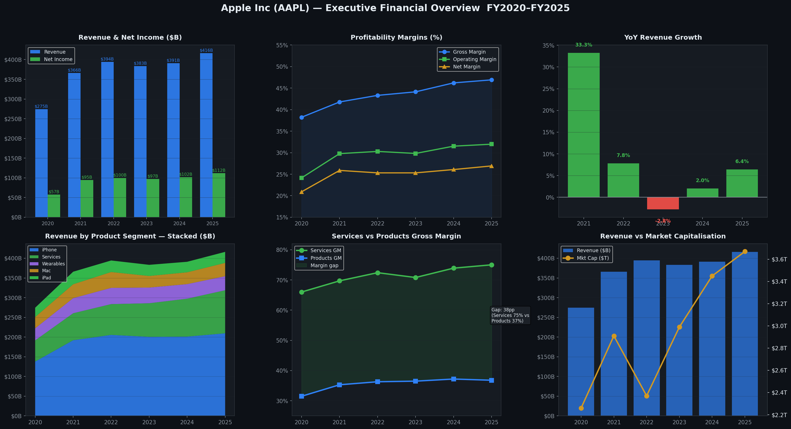
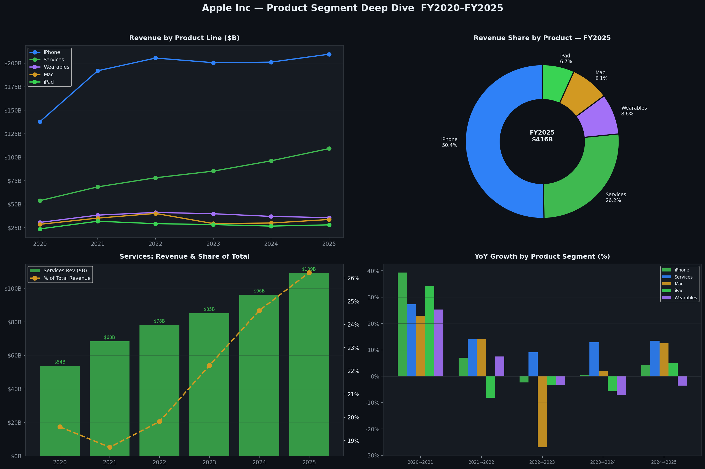
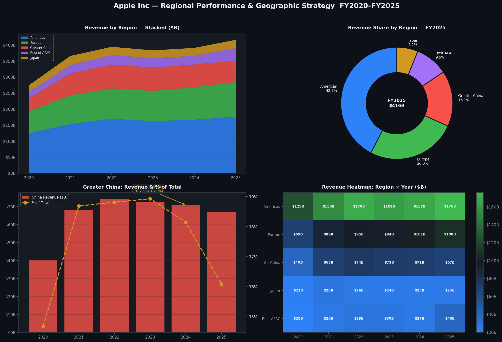
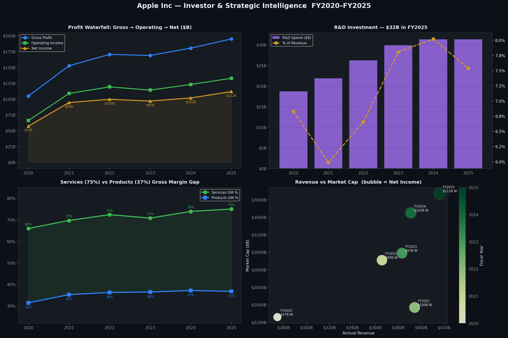

# 🍎 Apple Inc (AAPL) — Financial Intelligence & Strategic Analysis


> A consulting-grade financial analysis of Apple Inc using **real data from official SEC 10-K filings** (FY2020–FY2025). Covers revenue trends, product segment performance, regional strategy, profitability drivers, and strategic intelligence for investors and analysts.

---

## 📊 Dashboard Preview

### Page 1 — Executive Financial Overview


### Page 2 — Product Segment Deep Dive


### Page 3 — Regional Performance & Geographic Strategy


### Page 4 — Investor & Strategic Intelligence


---

## 📁 Project Structure

```
apple-financial-analysis/
│
├── assets/
│   ├── 01_executive_overview.png     # Revenue, margins, YoY growth, market cap
│   ├── 02_product_segments.png       # iPhone, Services, Mac, iPad, Wearables
│   ├── 03_regional_analysis.png      # Americas, Europe, China, APAC, Japan
│   └── 04_investor_strategy.png      # Profit waterfall, R&D, margin gap, bubble
│
├── analysis.py                        # Full analysis — regenerates all charts
├── requirements.txt                   # Python dependencies (matplotlib, numpy only)
└── README.md                          # This file
```

---

## 📈 Key Financial Data (from SEC 10-K filings)

### Revenue Overview ($B)

| Metric | FY2020 | FY2021 | FY2022 | FY2023 | FY2024 | FY2025 |
|---|---|---|---|---|---|---|
| **Total Revenue** | $274.5B | $365.8B | $394.3B | $383.3B | $391.0B | $416.2B |
| iPhone | $137.8B | $192.0B | $205.5B | $200.6B | $201.2B | $209.6B |
| Services | $53.8B | $68.4B | $78.1B | $85.2B | $96.2B | **$109.2B** |
| Wearables | $30.6B | $38.4B | $41.2B | $39.9B | $37.0B | $35.7B |
| Mac | $28.6B | $35.2B | $40.2B | $29.4B | $30.0B | $33.7B |
| iPad | $23.7B | $31.9B | $29.3B | $28.3B | $26.7B | $28.0B |

### Profitability ($B)

| Metric | FY2020 | FY2021 | FY2022 | FY2023 | FY2024 | FY2025 |
|---|---|---|---|---|---|---|
| Gross Profit | $105.0B | $152.8B | $170.8B | $169.2B | $180.7B | $195.2B |
| Operating Income | $66.3B | $108.9B | $119.4B | $114.3B | $123.2B | $133.1B |
| Net Income | $57.4B | $94.7B | $99.8B | $97.0B | $102.0B | **$112.0B** |

### Margin Profile (%)

| Margin | FY2020 | FY2021 | FY2022 | FY2023 | FY2024 | FY2025 |
|---|---|---|---|---|---|---|
| Gross Margin | 38.2% | 41.8% | 43.3% | 44.1% | 46.2% | **46.9%** |
| Operating Margin | 24.2% | 29.8% | 30.3% | 29.8% | 31.5% | **32.0%** |
| Net Margin | 20.9% | 25.9% | 25.3% | 25.3% | 26.1% | **26.9%** |

---

## 🧠 Key Strategic Findings

### 🟢 Services Is Now Apple's Most Important Business

```
Services Revenue Growth:
FY2020:  $53.8B  (19.6% of total)
FY2021:  $68.4B  (18.7% of total)
FY2022:  $78.1B  (19.8% of total)
FY2023:  $85.2B  (22.2% of total)
FY2024:  $96.2B  (24.6% of total)
FY2025: $109.2B  (26.2% of total)  ← First $100B+ year
```

Services generates **75% gross margin** vs **37% for hardware products** — a 38 percentage-point gap. Every dollar shifted from hardware to Services adds ~2x the gross profit. This structural shift is the primary reason Apple's blended gross margin expanded from 38% to 47% in just 5 years.

---

### 🟡 Greater China — A Growing Strategic Risk

```
Greater China Revenue:
FY2021: $68.4B  (18.7% of total)  ← Peak
FY2022: $74.2B  (18.8% of total)
FY2023: $72.6B  (18.9% of total)
FY2024: $71.0B  (18.2% of total)
FY2025: $67.0B  (16.1% of total)  ← 3-year revenue decline
```

Greater China has declined for **three consecutive years**, from a peak of $74.2B in FY2022 to $67.0B in FY2025. Risks include Huawei competition, local nationalism, and potential trade tensions. China at 16% of revenue remains Apple's third-largest market and a material concentration risk.

---

### 🔵 The iPhone Dependency Is Slowly Reducing

```
iPhone as % of Total Revenue:
FY2020: 50.2%
FY2021: 52.5%
FY2022: 52.1%
FY2023: 52.3%
FY2024: 51.5%
FY2025: 50.4%
```

iPhone still dominates at **50% of revenue**, but Services' rapid growth is steadily diluting that concentration — from a high of 52.5% in FY2021 to 50.4% in FY2025. At the current trajectory, Services could surpass 30% of revenue by FY2027.

---

### 🔴 Wearables Plateau — A Category Under Pressure

The Wearables, Home & Accessories category peaked at **$41.2B in FY2022** and has declined every year since, reaching $35.7B in FY2025 — a **13% contraction** over three years. This signals market saturation for Apple Watch and AirPods, and a lack of breakthrough category expansion despite Vision Pro's launch.

---

### 🟢 R&D Discipline: $31B Invested Annually

Apple invested **$31.4B in R&D in FY2025**, representing 7.5% of revenue — consistent with prior years. This restraint (vs peers like Alphabet at ~15%) reflects Apple's model of concentrated innovation over wide research bets. The pipeline includes Apple Intelligence (AI), Vision Pro, automotive tech, and health monitoring.

---

### 🟢 Americas Dominance Remains Rock-Solid

```
Americas Revenue:
FY2020: $124.6B  (45.4% of total)
FY2025: $176.1B  (42.3% of total)
```

Americas continues to generate the largest regional revenues, growing from $124.6B to $176.1B. Despite the declining share (due to faster international growth), this market remains Apple's most profitable and stable base.

---

## 📌 Consulting-Level Recommendations

| # | Priority | Recommendation |
|---|---|---|
| 1 | 🟢 **Accelerate** | Double down on Services expansion — App Store, Apple Intelligence, Apple Pay, Health |
| 2 | 🟡 **Monitor** | China revenue decline needs strategic response: local partnerships or product localization |
| 3 | 🔴 **Innovate** | Wearables need a new category breakthrough; Apple Watch market is saturating |
| 4 | 🟢 **Leverage** | Services margin gap (75% vs 37%) justifies aggressive bundle pricing (Apple One) |
| 5 | 🔵 **Diversify** | India expansion is critical to offset China risk — growing 30%+ annually |
| 6 | 🟡 **Watch** | Mac declined sharply in FY2023 (–27% YoY) — Apple Silicon cycle must sustain upgrades |

---

## ⚙️ How to Run

### 1. Clone the repo
```bash
git clone https://github.com/YOUR_USERNAME/apple-financial-analysis.git
cd apple-financial-analysis
```

### 2. Install dependencies
```bash
pip install -r requirements.txt
```

### 3. Generate all charts
```bash
python analysis.py
```

All 4 charts will be saved to `/assets/` automatically.

> **Note:** No external data files needed. All data is hardcoded directly from Apple's official SEC 10-K filings and is cited with source links below.

---

## 📚 Data Sources

All data sourced from Apple's official publications:

| Source | URL |
|---|---|
| Apple SEC 10-K FY2025 | https://investor.apple.com/sec-filings/annual-reports |
| Apple SEC 10-K FY2024 | https://www.sec.gov/cgi-bin/browse-edgar?action=getcompany&CIK=AAPL |
| Apple SEC 10-K FY2023 | https://www.sec.gov/Archives/edgar/data/320193/ |
| Apple SEC 10-K FY2022 | https://www.sec.gov/Archives/edgar/data/320193/ |
| Apple SEC 10-K FY2021 | https://www.sec.gov/Archives/edgar/data/320193/ |
| Apple SEC 10-K FY2020 | https://www.sec.gov/Archives/edgar/data/320193/ |

> Apple's fiscal year ends in late September. FY2025 = October 2024 – September 2025.

---

## 🛠️ Tech Stack

| Tool | Purpose |
|---|---|
| `matplotlib` | All chart generation |
| `numpy` | Numerical operations |
| Python stdlib | No other dependencies |

Deliberately minimal — **no pandas, no external data files** — so the script runs in any Python 3.8+ environment instantly.

---

## 📄 License

MIT License — free to use, adapt, and share with attribution.

---

*Data accuracy: All figures are sourced directly from Apple's SEC 10-K filings. Market capitalisation figures are approximate year-end values. This analysis is for educational and informational purposes only and does not constitute financial advice.*
